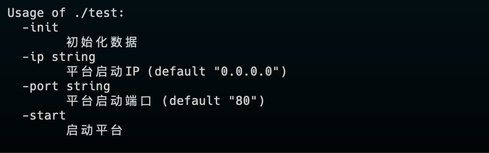
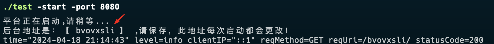
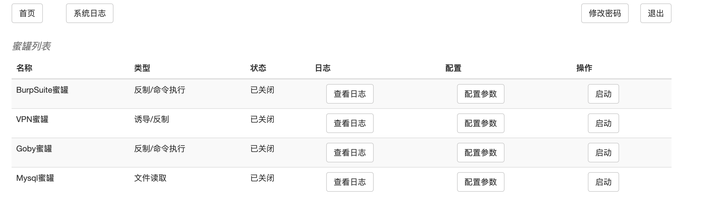

# potManager

使用方法：

请确保`register.exe`(windows下)和`register`(linux下)存在于蜜罐管理平台运行的所在目录下。

使用`main.exe -h`即可查看启动帮助



**初次使用时必须使用 `-init`参数初始化数据。**

启动完毕后会提示后台地址：



然后拼接此地址即可登录后台：

例如：

```txt
http://localhost:8080/bvovxsli/
```

平台默认用户名密码：venus/venus@2021



登录后务必修改密码！！！
